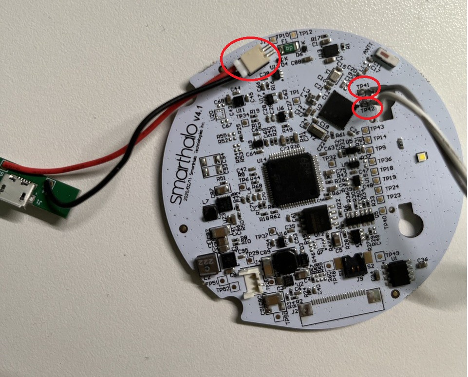
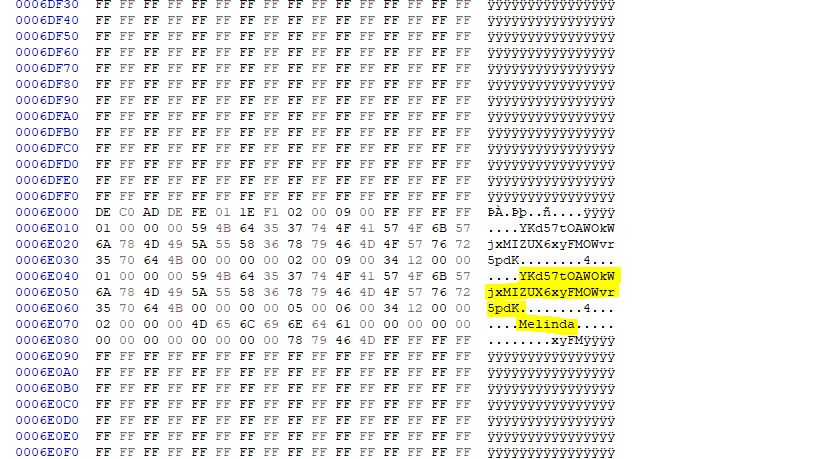
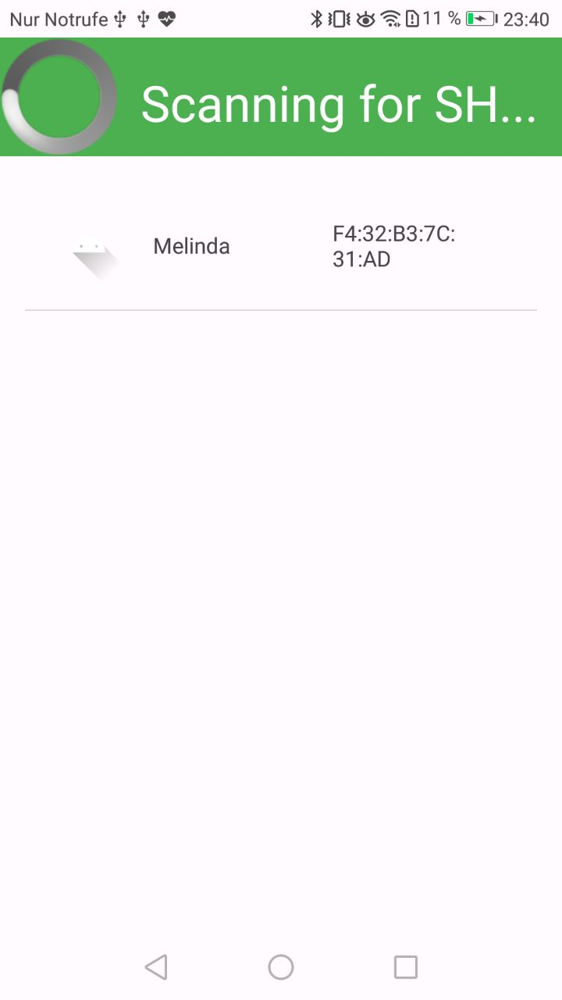
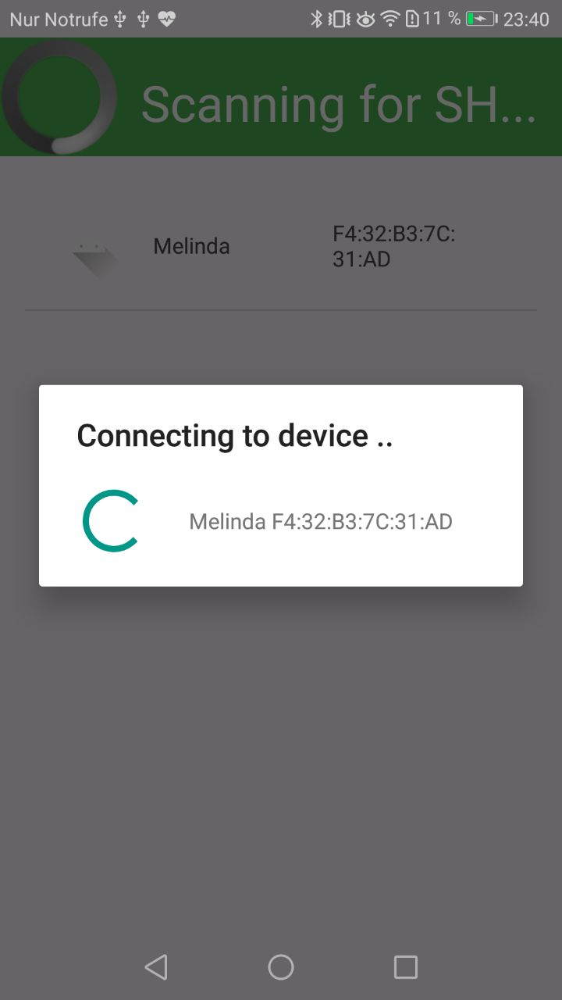
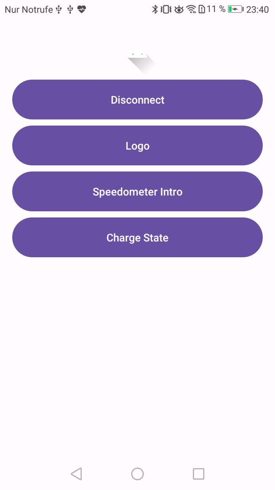

# Reverse Engineering of Smart Halo 2

## Extract the Firmware via JLink/SWD

In order to get the device password the firmware must be extracted. This can be done via SWD and requires an adapter.
I used a [ST-Link V2](https://www.amazon.com/ST-Link-Emulator-Downloader-Programmer-STM32F103C8T6/dp/B09MN4TLD2/ref=sr_1_8?keywords=Stlink+V2&qid=1694816128&sr=8-8) since its very cheap an compatible with the nRF52832 chip.



`SWDIO` must be connected to port `TP41` and `SWDCLK` to port `TP42`. For `GND` the USB port can be used. 

### Install OpenOCD

Depending on the SWD adapter the extraction can be different. For the ST-Link V2 we will use OpenOCD to interact with the chip. 

For Ubuntu this involves the following steps:

Download OpenOCD from here:
https://netix.dl.sourceforge.net/project/openocd/openocd/0.10.0/openocd-0.10.0.zip

```
unzip openocd-0.10.0.zip

cd openocd-0.10.0

sudo apt-get install make libtool pkg-config autoconf automake texinfo libusb-1.0-0-dev

./configure --enable-maintainer-mode --disable-werror --enable-ft2232_libftdi

make

sudo make install
```

### Extract Firmware with OpenOCD

OpenOCD requires a config file in order to work with different adapters and targets. For the ST-Link V2 and nRF52 there are already files.
Lets copy them into one file:
```
cat /usr/local/share/openocd/scripts/interface/stlink-v2.cfg /usr/local/share/openocd/scripts/target/nrf52.cfg >> nrf.cfg
```

Finally we can run OpenOCD with the created config:
```
sudo openocd -f nrf.cfg
```

OpenOCD should now run and we can interact with it via telnet. 
Open a new terminal and run:
```
telnet 127.0.0.1 4444
```

Now we can extract the firmware:
This dumps the 512 kB firmware (0x80000 from 0x0)
```
dump_image sh_nrf52832.bin 0x0 0x80000
```

### Find Device Password

`sh_nrf52832.bin` can now be analysed in a Hex Editor (e.g. https://mh-nexus.de/en/hxd/). 
The device password (max 32 chars) should be stored close to the device name. 
You can also use [Ghidra](https://github.com/NationalSecurityAgency/ghidra) to find all defined strings in the firmware. 



## Android Debug App

The app can be used to communicate with a SmartHalo 2 Device.
In order to successfully authenticate with the device, the device password must be set in the `ServiceStorageController` constructor (`this.password = "<DEVICE_KEY>";`).





